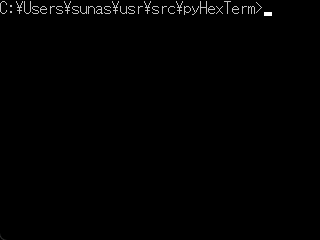

# pyHexTerm
Simple Hex Serial Terminal for pySerial.

Example communication to CH9350L chip through USB-UART converter connected to COM5 port:


# Environment
- Windows11 10.0.25126
- Python 3.10.4
- pyserial 3.5

# Usage
pyhexterm &lt;portname&gt;,&lt;baudrate&gt; [-ip <input_prompt>] [-op <output_prompt>] [-cn <chunk_num>]  
example: ```py pyhexterm COM1,115200```

If you need to use other pyserial options (parity,timeout,xonxoff,etc), please add these options to serial.Serial() in this script.  
On Cygwin or MSYS terminal, use winpty like this: ```winpty py pyhexterm.py```

# License
These codes are licensed under BSD-3-Clause.
See [LICENSE](https://github.com/sunasaji/pyHexTerm/blob/master/LICENSE) for details.
